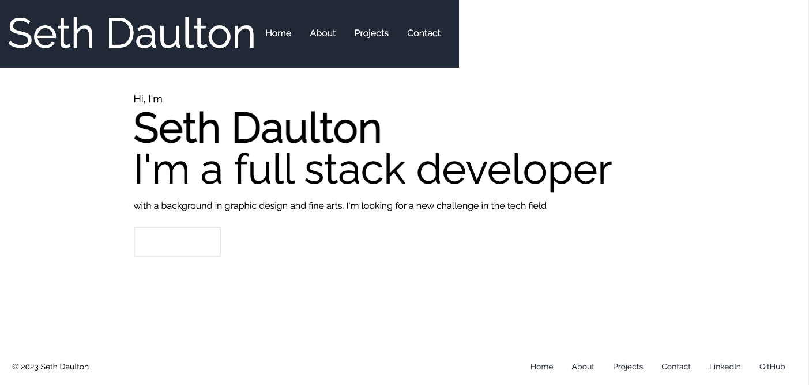

# React-Portfolio

## Description

For this assignment I was tasked with creating a portfolio from scratch using React as a main component. My site has several sections and features: a homepage, a contact form, an about section, a navbar, a projects section, and a footer. 

## Screenshot

The site is deployed at the following link: https://sethdaulton.github.io/React-Portfolio/. 

My GitHub repository for the project can be viewed at the following link: https://github.com/sethdaulton/React-Portfolio. 